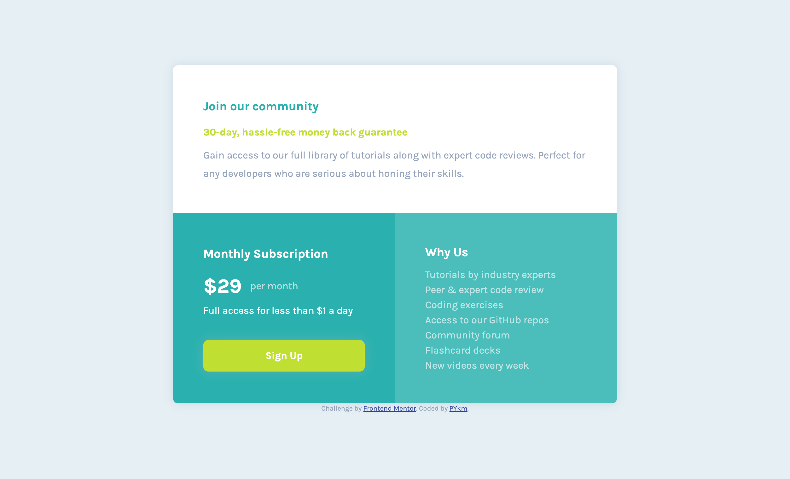

# Frontend Mentor - Single price grid component solution

This is a solution to the [Single price grid component challenge on Frontend Mentor](https://www.frontendmentor.io/challenges/single-price-grid-component-5ce41129d0ff452fec5abbbc). Frontend Mentor challenges help you improve your coding skills by building realistic projects.

## Table of contents

- [Overview](#overview)
  - [The challenge](#the-challenge)
  - [Screenshot](#screenshot)
  - [Links](#links)
- [My process](#my-process)
  - [Built with](#built-with)
  - [What I learned](#what-i-learned)
  - [Continued development](#continued-development)
  - [Useful resources](#useful-resources)
- [Author](#author)

## Overview

### The challenge

Users should be able to:

- View the optimal layout for the component depending on their device's screen size
- See a hover state on desktop for the Sign Up call-to-action

### Screenshot




### Links

- Solution URL: [on Frontend Mentor](https://www.frontendmentor.io/solutions/single-price-grid-component-ZG0diTiLeS)
- Live Site URL: [on Github](https://pykm.github.io/single-price-grid/)

## My process

### Built with

- Semantic HTML5 markup
- CSS custom properties
- Flexbox
- CSS Grid
- Mobile-first workflow

### What I learned

Use `<a>` instead of `<button>` for `Sign Up`:

```html
<a href="#">Sign Up</a>
```

Use `vertical-align: middle;` adjust vertical alignment inside a `p` element:

```html
<section class="subscription">
  <p><strong>&dollar;29</strong> <span>per month</span></p>
</section>
```
```css
.subscription p > * {
  vertical-align: middle;
}
```

### Continued development

Technique that I'm not completely comfortable with, can be found in this challenge:
- Use grid layout.
- Use `grid-row` and `grid-column` to place things on a grid.

Technique that I found useful, although not using in this challenge:
- SASS

### Useful resources

- [Grids on MDN](https://developer.mozilla.org/en-US/docs/Learn/CSS/CSS_layout/Grids) - This helped me to understand basic MDN. I found it useful.
- [When to use button element](https://css-tricks.com/use-button-element/) - I'm always confused about whether it should be a button or an anchor element. This article helped me to confirm that it should be an anchor element in this challenge.

## Author

- Website - [PYkm](https://pykm.github.io/)
- Frontend Mentor - [@PYkm](https://www.frontendmentor.io/profile/PYkm)
